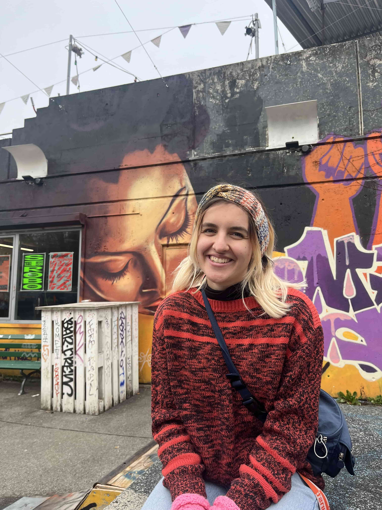

+++
title = "Chancen und Themen im Gaskessel Bern"
date = "2024-02-21"
draft = false
pinned = false
+++



Der Gaskessel Bern, ein Ort zum Leben und Lernen. So durfte ihn auch Xenia Unseld  kennenlernen. 



Julian Kolly, Alma Guggisberg

Der Gaskessel Bern, viele bunte Räume. Ein lautes Geräusch kommt aus einem Raum. Der grosse Kessel wird geputzt. Die Treppe hinunter kommt Xenia Unseld mit einem Lächeln auf dem Gesicht. Sie arbeitet im Gaskessel Bern als Lichttechnikerin.  Was sie begeistert an ihrer Arbeit und am Gaskessel, erzählt sie entspannt in der Küche.

###### Was bedeutet dir der Gaskessel? 

Ich bin durch eine Party auf den Gaskessel gestossen. Die Leute waren sofort sehr offen und hilfsbereit. In diesem Umfeld konnte ich schnell lernen und habe viele tolle Erfahrungen gesammelt. Ich würde sagen, für mich bedeutet der Gaskessel Familie. Es ist ein schönes Gefühl hier dazu zu gehören. Ich habe den Gaskessel so richtig ins Herz geschlossen. 

###### Du lerntest im Gaskessel Lichttechnik. Was war deine Motivation dafür? Und wieso genau im Gaskessel?

Ich bin sehr Geschlechtsstereotypisch aufgewachsen. Ich dachte immer: eine Frau in der Technik? Geht das? Am Anfang war ich sehr unsicher. Ich hatte aber viele großartige Menschen um mich , die mich unterstützten. Ich bekam viele Tipps und Einführungen, bis ich mich wohl fühlte und wusste, dass ich das kann.  Sie liessen mich ausprobieren und vertrauten mir. Deshalb bin ich auch froh, dass ich dies eben im Gaskessel lernen durfte. 

###### Hattest du denn schon immer Interesse an Technik? 

Ich wollte früher immer den Twingo meiner Eltern reparieren. Ich glaube, da war dieses Technische und Kreative auch schon vorhanden. Ich habe sehr lange gebraucht, um zu akzeptieren, dass  ich nicht studieren muss, um das zu erreichen, was ich will. Da hat mir der Gaskessel und sein Umfeld viel geholfen. Jetzt habe ich ein bisschen andere Arbeitszeiten als zum Beispiel Leute mit einem Bürojob. Aber ich habe auch schon früher während der Schulzeit alle Arbeiten in der Nacht vor der Abgabe geschrieben. Als ich erfahren habe, dass es das als Beruf gibt, dachte ich: WOW. Ich arbeite hier vom Abend bis manchmal früh morgens, das gefällt mir. 

###### Du arbeitest manchmal sogar bis früh morgens. Hat es auch Nachteile, in der Nacht zu arbeiten? 

Für mich nicht wirklich. Ich habe keine Mühe, damit lang wach zu bleiben. Mit den sozialen Kontakten muss man sich mehr organisieren, aber das muss man sowieso, sobald man nicht mehr in die Schule geht. Ausserdem habe ich viele enge Freundschaften im Gaskessel geschlossen.

###### Du fühlst dich sehr wohl im Gaskessel und hast auch neue Freundschaften geschlossen. Was schätzt du am meisten an deinem Team?

Man ist gut aufgehoben im Team. Ich hatte einmal eine Schicht mit einer grenzüberschreitenden Band. Schon am nächsten Morgen hatte ich ein Telefon mit einem Mitarbeiter, der mich fragte, wie es mir geht.  Ich denke, der Teamzusammenhalt ist, was ich am meisten schätze am ganzen Gaskessel Team.

###### Gibt es solche Vorfälle oft mit Bands? 

Nein, solche Vorfälle sind sehr selten, trotzdem ist es schade, dass es überhaupt noch passiert. 

###### Der Gaskessel veranstaltet auch Partys. Wie sieht es mit Übergriffen und dem Konsum von Drogen aus? Und wie geht ihr dagegen vor?

Beim Konsum können wir sagen, es passiert nicht, aber am Ende passiert es einfach im Dunkeln. Wir dulden keinen offenen Konsum und keinen Drogenhandel und gehen mit Securitys dagegen vor. Zusätzlich haben wir ein Awareness- Aufklärungssystem, das ist aber noch extrem in der Probephase. Man sollte Übergriffe offen kommunizieren und wissen, an wen man sich wenden kann, wenn solche passieren.  Darüber wird man informiert, bevor man den Club betritt. Das Ziel ist, Awareness mehr ans Licht zu bringen.

###### Der Gaskessel entwickelt sich immer weiter. Was macht den Gaskessel heute aus?

Er war immer schon von Jugendlichen geprägt und ich denke, das ist auch was ihn heute noch ausmacht. 

###### Willst du später Platz machen für eine jüngere Person?

Ja, in etwa zehn Jahren will ich Platz gemacht haben in dieser Position, die ich jetzt habe. Platz für eine junge Person. Ausserdem ist der Gaskessel ein gutes Sprungbrett für mein Leben. Ich will, dass auch andere Personen diese Chance nutzen können. Weiterhin beteiligen will ich mich trotzdem. Der Gaskessel ist meine Heimat und das wird er auch immer sein. Dennoch liegt es mir am Herzen, dass er im Wandel bleibt. Für diesen Wandel gebe ich meinen Platz gerne weiter.

>  **“Für mich bedeutet der Gaskessel Familie”**
>
> *Xenia Unseld*



**Infokasten**

Awarness-System: Ein Konzept zur Unterstützung gegen sexualisierte Gewalt, übergriffiges Verhalten und Diskriminierung

