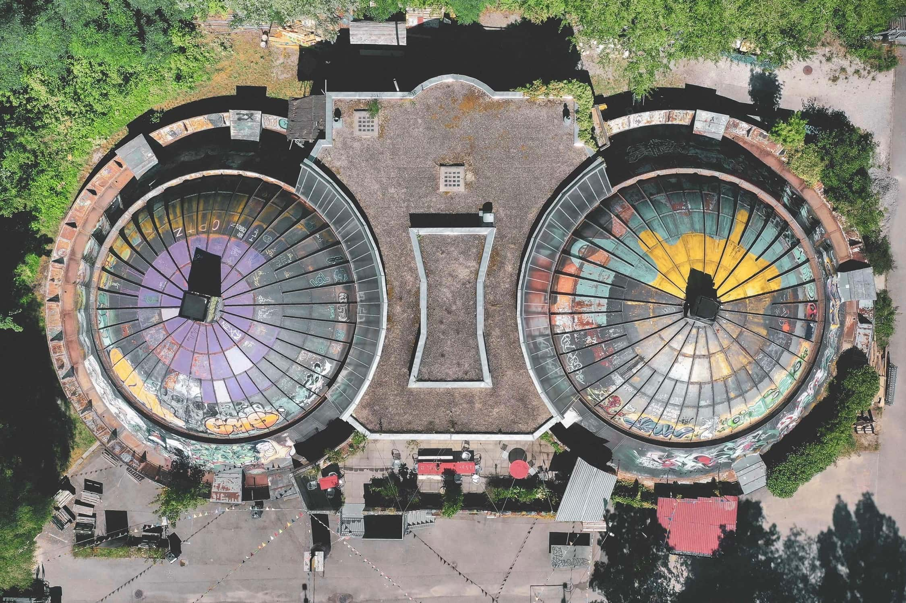
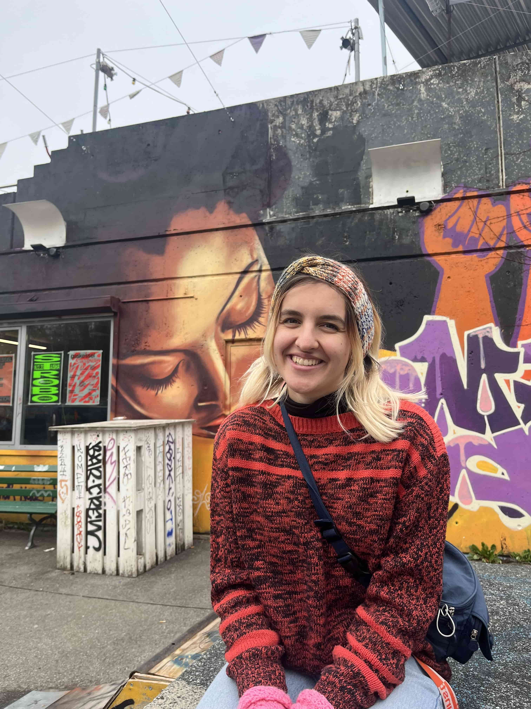
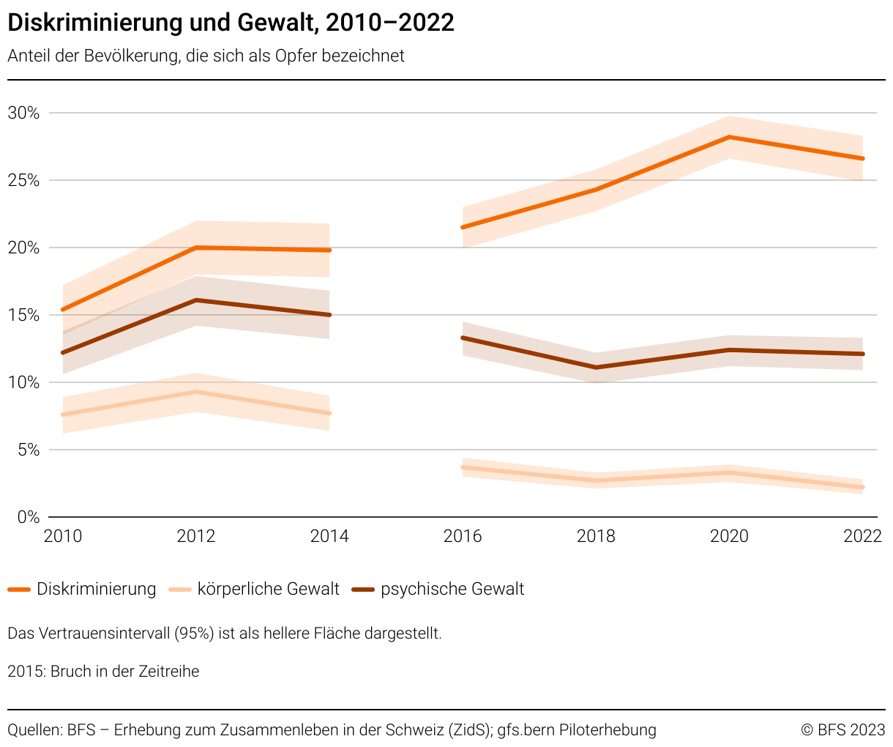

+++
title = "Gaskessel: Jugendkultur im Wandel"
date = "2024-02-21"
draft = false
pinned = false
image = "36801356-4405-4a61-883c-519ea6486963_1_201_a-min.jpeg"
description = "Als Folge der 68er - Jugendunruhen entstand auf dem ehemaligen Gaswerkareal etwas Neuartiges, eines der ältesten Jugendkulturzentren Europas. Unter den farbigen Dächern des Gaskessels wird gelebt, diskutiert, akzeptiert, getanzt und einfache Momente werden zu etwas Besonderem gemacht. Eine Gemeinschaft ohne Ängste - Wie ein Awareness Konzept dazu beitragen kann, Minoritäten zu schützen.\n"
+++


Durch die Jugendunruhen (1968/69) entstand auf dem ehemaligen Gaswerkareal etwas Neuartiges - eines der ältesten Jugendkulturzentren Europas. Unter den farbigen Dächern des Gaskessels wird gelebt, diskutiert, akzeptiert, getanzt und einfache Momente werden zu etwas Besonderem gemacht. Eine Gemeinschaft ohne Ängste. Ein Awareness Konzept trägt dazu bei, Minoritäten zu schützen und sorgt für eine offene Gemeinschaft.



Alma Guggisberg & Julian Kolly

Wie ein Regenbogen. Daran erinnert der Gaskessel, wenn einem die Flaggen und Graffitis ins Auge stechen. Begrüsst werden wir von Xenia mit einer herzliche Umarmung ohne jegliche Vorurteile danach führt sie uns durch den warmen und einladenden Gaskessel. Xenia. Hier sind alle per Du, ein familiäres Gefühl verbreitet sich unter den Halbkugeln des ehemaligen Gaswerkareals. In der Gemeinschaftsküche steigt ein einladender Geruch in die Nase, es riecht nach Minze. Bei einem warmen Tee erzählt uns Xenia über sich und den Gaskessel. Es ist ruhig, anders als man es vom Gaskessel kennt, doch Xenias Stimme füllt den Raum und sie spricht offen über das, was andere nicht hören wollen. 

### Xenia Unseld: Im Herzen der Nacht

Während die meisten Personen der Gesellschaft in ihren Träumen versinken, unterbricht Xenia Unseld die Stille und Dunkelheit der Nacht. Im Gaskessel sorgt sie für Stimmung hinter dem Lichtpult. Als FLINTA\*- Person\* stellt sie  dort als Vorbild dar. „Ich bin auf dem Land aufgewachsen, es ist etwa so, wie ihr es euch vorstellt.” Xenia wurde in einem Umfeld aufgezogen, welches geschlechtsstereotypisch geprägt war. „Ich dachte immer: eine Frau in der Technik, geht das?" Im Gaskessel fand sie den Mut, ihre festgefahrenen Vorstellungen zu durchbrechen und begann, ihre eigenen Ziele zu verfolgen. Xenia strebt mit ihrer Arbeit im Gaskessel nach mehr: Ihr Ziel ist es, im Gaskessel nicht nur für Unterhaltung zu sorgen, sondern auch eine Atmosphäre zu schaffen, in der jede*r, unabhängig von Hintergrund oder Identität, einen Platz findet.

> **„Ich dachte immer: Eine Frau in der Technik. Geht das?”**
>
> *Xenia Unseld*

In ihrer Kindheit träumte Xenia davon, Twingoflickerin* zu werden. Ihr technisches Interesse zeigt sich früh. Im Gaskessel bekommt sie diese Verantwortung und ihr wird viel Wissen von den erfahrenen Mitgliedern weitergegeben. Inmitten dieser unkonventionellen Welt des Gaskessels erkennt Xenia, dass sie diesen Weg gehen kann.

\*Twingo ist ein Grossserienmodell von Renault

\* FLINTA\* Personen steht für Frauen, Lesben, intergeschlechtliche, nichtbinäre, trans und agender Personen.

### Lernen und profitieren vom Gaskessel Bern

Der Gaskessel ist nicht nur ein Ort des Engagements, sondern eine Plattform, die Menschen dazu ermutigt, ohne Ausbildung und Vorkenntnisse Neues zu lernen. Der Gaskessel bildet eine Gemeinschaft. Gestärkt durch Zusammenhalt, geteilte Meinungen und gemeinsame Ziele. Im Gaskessel braucht es Motivation und Bereitschaft, es ist eine Chance, sich selbst und andere zu bereichern, während man gleichzeitig von der kollektiven Stärke der Gemeinschaft profitiert. Der Gaskessel wird von vielen Menschen geliebt, dies fällt beim Betreten auf. Viele Projekte werden in und um diese Wände auf die Beine gestellt.

### 50 Jahre - Jugendkultur in Bewegung

Der Gaskessel fungiert schon seit über 50 Jahren als ein lebendiges Archiv von Generationen und als zentraler Ort für die Jugend von Bern. Vieles von dem, was hier getan wird, geschieht in Form von Freiwilligenarbeit und aus Eigeninteresse. Jede Person, die über 16 Jahre alt ist, hat die Möglichkeit, sich einzubringen und Verantwortung zu übernehmen, unabhängig von ihrem Hintergrund. In den vielen Jahren hat sich einiges geändert. Eine Sache aber blieb über all diese Jahre gleich. Der Gaskessel ist und bleibt ein Kulturzentrum, das von jungen Menschen für junge Menschen geschaffen wurde. Der Gaskessel ist von ihnen geprägt und das soll in Zukunft auch nicht anders sein. Darüber ist sich auch die Gaskessel Gemeinschaft einig. „Der Gaskessel ist immer im Wandel, was sehr wichtig ist,” sagt Xenia und auch sie denkt über ihre Zukunft im Gaskessel nach: „In zehn Jahren will ich Platz gemacht haben für eine andere junge Person. Mich beteiligen und Dasein will ich aber weiterhin.” Somit entwickelt sich die Institution auch immer weiter und neue Ideen können entstehen und umgesetzt werden.   

Xenia ist eine äusserst aufgeschlossene Person. Sie plant Projekte, die für politische und 

gesellschaftliche Aufklärung sorgen. Ihre Ansicht ist klar: Die Welt muss durch Politik und Awareness sensibilisiert und aufgeklärt werden.

### Ein Kulturzentrum im Wandel:

Nach den finanziellen Schwierigkeiten des Gaskessels geht es wieder bergauf: “Zurzeit sind wir 70% selbsttragend”, verkündet Xenia voller Stolz. Der Gaskessel macht alles richtig, die Stadt zeigt Interesse und Unterstützung gegenüber ihnen. Als der Gaskessel 1971 durch die Berner Jugendunruhen ins Leben gerufen wurde, konnte man kaum ahnen, dass er bis heute so eine zentrale Rolle im Berner Nachtleben spielen würde. Doch genau das tut er. Die farbigen Kuppeln neben der Aare stellen einen sicheren Platz für Jugendliche dar. Ein Platz für alle, und dieser entscheidende Grundsatz ist in der Organisation des Gaskessels fest verankert. Auf dem Berner Gaskessel - Areal gibt es keinen Raum für Diskriminierung; ein Awareness Konzept sorgt für Sicherheit. Es ensteht eine Gemeinschaft, die sich klar gegen Diskriminierung und jegliche Art von Übergriffen stellt und sich gemeinsam für Inklusion einsetzt. „Awareness ist ein sehr wichtiges Thema und man sollte auch Übergriffe offen kommunizieren.” Für Xenia ist klar: „Es gibt leider immer noch zu wenige Awareness Zuständige.”



##### Statistik Diskriminierung Schweiz

Unter Diskriminierung versteht man Handlungen oder Tätigkeiten, die Personen aufgrund von diversen Merkmalen wie z.B. Herkunft, Glauben, Aussehen, Geschlecht, Identität, … benachteiligen, unterdrücken, demütigen, bedrohen oder gefährden deren Integrität.

**<https://www.bfs.admin.ch/bfs/de/home/statistiken/bevoelkerung/migration-integration/zusammenleben-schweiz/diskriminierung.html>**



> **„Es gibt leider immer noch zu wenig Awareness Zuständige.”**
>
> *Xenia Unseld*

Die Nacht erwacht. Es wird lebendig im Gaskessel und die Stimmung steigt, doch mit ihr steigt auch der Konsum von legalen wie auch illegalen Drogen. Das Gaskessel-Team schaut aufmerksam hin, unterstützt von den Securities. Offener Konsum wird nicht toleriert. Doch die Realität ist allen bewusst. Kommt es zu einem Vorfall, ist Kommunikation gefragt, das Team schreitet ein und sanktioniert entsprechend. 

\


### Awareness - Begriffsdefinition und Kontextualisierung:

Awareness bezeichnet das “Bewusstsein” oder die “Aufmerksamkeit” für ein gewisses Thema oder  Problem in einer Gruppe oder Bevölkerung. Der Begriff wird insbesondere im Aktivismus verwendet. 

Awareness im Aktivismus bedeutet, Diskriminierungen zu erkennen und Sensibilität zu entwickeln. Ziel ist die Unterstützung von Menschen, die Schaffung diskriminierungsfreier Veranstaltungen und das Entwickeln von Empathie und Solidaritätsgefühl. 

**<https://www.awareness-intersektional.de/wp-content/uploads/2021/12/Awareness-Leitfaden-Web.pdf>**



### Gaskessel heute: Solidarität und Vielfalt

Die Besucher\*innen warten in Schlangen vor dem Club. Ein Stempel und dann soll der Abend so richtig losgehen. Vor dem Eingang werden alle Besucher\*innen aufgeklärt von einer Awareness zuständigen Person. Informationen wie: An wen kann ich mich wenden, wenn mir etwas passiert? An wen kann ich mich wenden, jemand anderes Hilfe braucht?, werden vermittelt. Besucher\*innen werden gebeten, Hilfe zu holen oder diese selbst anzubieten, wenn es notwendig ist. Das Awareness Konzept soll Prävention gegen Diskriminierung und sexuelle Belästigung/Gewalt bieten. Über dieses Thema wird oft viel zu wenig gesprochen. Das will der Gaskessel aber unbedingt ändern. Man erhofft sich, dass durch diese Aufklärung noch mehr Sicherheit geboten werden kann. Man ist sich aber auch bewusst, dass dieses Konzept alleine das Problem nicht löst. Jedoch ist es ein Schritt in die richtige Richtung und hat sich bis jetzt positiv bewährt. Die Jugendlichen genießen die positive Atmosphäre, die durch das Awareness-Konzept geschaffen wird. Die Stimmung ist entspannt und das Sicherheitsgefühl ist präsent. Die interviewten Personen vertrauen auf das Konzept und fühlen sich wohl inmitten der Besucher\*innen. Viele fühlen sich gehört und in ihrer Meinung repräsentiert.

> **„In zehn Jahren will ich Platz gemacht haben für eine andere junge Person. Mich beteiligen und dasein will ich aber weiterhin.”** 
>
> *Xenia Unseld*

Auch in Zukunft sollen die Flaggen am Gaskessel weiter wehen und ein Zeichen sein. Egal wer du bist und von wo du kommst, hier bist du willkommen. Er soll Jugendlichen Chancen bieten und ein grosses Lernfeld darstellen. Ein Zentrum, in dem offen gesprochen und sensibilisiert wird, muss es immer geben. Der Gaskessel bleibt im Wandel, Menschen kommen und gehen. So wird auch Xenia eines Tages Platz für neue Gesichter machen, doch bis dahin geht sie noch einen bedeutsamen Weg. “Der Gaskessel ist meine Heimat und das wird er auch immer sein.”



##### Fixpunkt Chessu:

Für interessierte Leser*Innen gibt es unter diesem Link einen Portraitfilm über den Gaskessel mit Fokus auf die Menschen von früher und heute.

<https://gaskessel-wanderausstellung.ch/portraetfilm>

